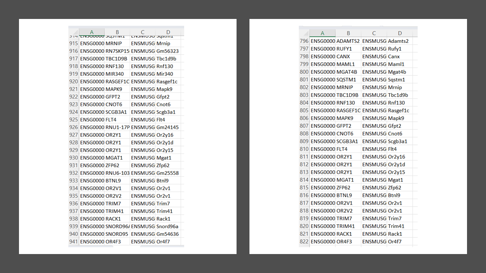

# R Pipeline Tutorial to Query and Manipulate Data from BioMart and RefSeq in Order to Perform a Pairwise Alignment Between Two Species 

## Overview

The following tutorial gives a step-by-step guide on how to successfully use the pipeline in order to get the desired results. A more in-depth and commented script for this pipeline can be found above as a .R file. In addition to this, the script has also been provided as a .Rmd file, which allows the code to be run in chunks rather than all at once. Since this is a tutorial, the following code is not definitive and is capable of being changed or altered in order to include different attributes, filters, or databases.

## Requirements

Step 1: Install and load all of the necessary packages in order for this pipeline to run successfully.

```R
if (!require("BiocManager", quietly = TRUE))
    install.packages("BiocManager")
BiocManager::install(version = "3.17")
BiocManager::install(c("biomaRt", "Biostrings"))
install.packages(c('rentrez', 'dplyr', 'readr', 'seqinr', 'stringr'))
```
```R
library(biomaRt)
library(Biostrings)
library(rentrez)
library(dplyr)
library(readr)
library(seqinr)
library(stringr)
```

Step 2: Set the directory location from which saved and read-in files will be stored.

```R
setwd("~/R")
```

## Selecting Marts

Step 3: Select a mart in order to access the Ensembl BioMart databases. All of the available marts can be accessed as a list and saved to a csv file.

```R
mart_finder <- function(file_name_1) {
  list_1 = listMarts(host='https://www.ensembl.org')
  write.csv(list_1, file_name_1, row.names=FALSE)
}
```
When this function is called, it should output a file that looks similar to the one below.


## Ensembl BioMart Databases 

Step 4: After selecting a particular mart, use it to access all its corresponding Ensembl BioMart databases. All of the available datasets can be accessed as a list and saved to a csv file.

```R
# A database represents a species
database_finder <- function(mart_name, file_name_2) {
   list_2 = useMart(biomart=mart_name, host='https://www.ensembl.org')
   list_2_new = listDatasets(list_2)
   write.csv(list_2_new, file_name_2, row.names=FALSE)
}
```

When this function is called, it should output a file that looks similar to the one below.


## Filters and Attributes For a Specific Ensembl BioMart Database

Step 5: Find the filters for a specific database. The filters will vary to a degree depending on the dataset selected. All of the available filters for a particular species dataset can be accessed and saved to csv file.

```R
# Filters and attributes get their own file
# This function is called twice (1 per different species)
filters<- function(type, species, file_1) {
  species_dataset = useEnsembl(biomart=type, dataset=species)
  list_1 = listFilters(species_dataset)
  list_2 =listAttributes(species_dataset)
  write.csv(list_1, file_1, row.names=FALSE)
  write.csv(list_2, file_2, row.names=FALSE)
}
```

When this function is called, it should output a filter file that looks similar to the one below.


Step 6: Find the filters and attributes for a specific database. The filters and attributes will vary to a degree depending on the dataset selected. All of the available filters and attributes for a particular species dataset can be accessed and saved to csv file.

```R
# Filters and attributes get their own file
# This function is called twice (1 per different species)
attributes <- function(type, species, file_1, file_2) {
  species_dataset = useEnsembl(biomart=type, dataset=species)
  list_1 = listFilters(species_dataset)
  list_2 =listAttributes(species_dataset)
  write.csv(list_1, file_1, row.names=FALSE)
  write.csv(list_2, file_2, row.names=FALSE)
}
```

When this function is called, it should output an attribute file that looks similar to the one below.


## Gather Data 

Step 7: Query data from a particular dataset based on specific attributes and filters in order to get specific queries. The queries for a particular species dataset can be saved as a csv file.

```R
dataset_retrieve <- function(type, species, chrom, file_name) {
  species_dataset = useEnsembl(biomart=type, dataset=species)
  # Attributes are specified
  species_query <- getBM(attributes=c('refseq_mrna', 'refseq_peptide', 'ensembl_gene_id',     
  'external_gene_name', 'description', 'start_position', 'end_position', 'strand',  
  # Genes filtered by chromosomal location
  'chromosome_name', 'name_1006'), filters =
  'chromosome_name', values =chrom, mart = species_dataset)
  write.csv(species_query, file_name, row.names=FALSE)
  species_csv = read.csv(file_name, na.strings = c("", "NA"))
  species_csv = species_csv %>% na.omit()
  write.csv(species_csv, file_name, row.names=FALSE)
}
```
When this function is called, it should output a file that looks similar to the one below.


  
Step 8: Find all the homologs for the two species of interest in order to make a gene list.

```R
gene_list <- function(species, chrom, species_2_id, species_2_gene_name, file_name) {
  species_dataset = useEnsembl(biomart="ensembl", dataset=species)
  # Attributes include gene name and ID for species_1, and ID and gene name for corresponding homolog species
  gene_list_query <- getBM(attributes=c('ensembl_gene_id','external_gene_name',
  species_2_id, species_2_gene_name), filters =
  'chromosome_name', values =chrom, mart = species_dataset)
  write.csv(gene_list_query, file_name, row.names=FALSE)
  genes_csv = read.csv(file_name, na.strings = c("", "NA"))
  genes_csv = genes_csv %>% na.omit()
  write.csv(genes_csv, file_name, row.names=FALSE)
}
```
When this function is called, it should output a file that looks similar to the one below.


## Filter Data 

Step 9: Filter the datasets so that they reflect the genes present on the gene list. These updated datasets can be saved to a csv file.

Note: The database images shown for this section are screenshots and don't show all of the information. Their main purpose is to show the successful functionality of the functions in regards to data filtering.

```R
# Queries are filtered out if they don't appear on the gene list for the first species dataset
gene_list_dataset_1_filter <- function(species, gene_list, species_filter, filter_gene) {
  # Species_1 dataset selected
  dataset = read.csv(species)
  # Uses gene list made from gene_list function
  genes = read.csv(gene_list)
  list_1 = genes %>% select(external_gene_name)
  list_1_column = unique(list_1)
  list_1_vector = unlist(list_1_column)
  query_1 = dataset[dataset$external_gene_name %in% list_1_vector, ]
  write.csv(query_1, species_filter, row.names=FALSE)
  list_2 =  query_1 %>% select(external_gene_name)
  list_2_column = unique(list_2)
  list_2_vector = unlist(list_2_column)
  query_2 = genes[genes$external_gene_name %in% list_2_vector, ]
  write.csv(query_2, filter_gene, row.names=FALSE)
}
```

```R
# Queries are filtered out if they don't appear on the gene list for the second species dataset
gene_list_dataset_2_filter <- function(species, gene_list, column_name, file_name_1, file_name_2) {
  # Species_2 dataset is selected
  dataset = read.csv(species)
  # Uses gene list made from gene_list_dataset_1_filter function
  genes = read.csv(gene_list)
  list_1 = genes %>% select(column_name)
  list_1_column = unique(list_1)
  list_1_vector = unlist(list_1_column)
  query_1 = dataset[dataset$ensembl_gene_id %in% list_1_vector, ]
  write.csv(query_1, file_name_1, row.names=FALSE)
  list_2 =  query_1 %>% select(ensembl_gene_id)
  list_2_column = unique(list_2)
  list_2_vector = unlist(list_2_column)
  query_2 = genes[genes[, column_name] %in% list_2_vector, ]
  write.csv(query_2, file_name_2, row.names=FALSE)
}
```
When these functions are called, they should output files similar to the ones shown in the following images. The following images show a database and gene list before and after filtering. Most noticeably, the filtered files have fewer rows than the non-filtered files.




```R
# First species dataset is updated to reflect filtered second species dataset
dataset_1_final_filter<- function(species, gene_list, file_name) {
  # Use species_1_filter from gene_list_dataset_1_filter function
  dataset = read.csv(species)
  # Uses filter_gene_final from gene_list_dataset_2_filter function
  genes = read.csv(gene_list)
  list_1 = genes %>% select(external_gene_name)
  list_1_column = unique(list_1)
  list_1_vector = unlist(list_1_column)
  query_1 = dataset[dataset$external_gene_name %in% list_1_vector, ]
  write.csv(query_1, file_name, row.names=FALSE)
}  
```

When this function is called, it should output a file similar to the one shown in the following image. The following image shows a database before and after filtering. Similar to the previous two functions, the filtered dataset has fewer rows than the non-filtered dataset.


## Filter Data By Gene Ontology

Step 10: Filter species datasets by gene ontology term and save to a csv file.

```R
# This function is called twice (1 per different species)
gene_ontology_filter <- function(file, go_term, go_name_filter) {
  filtered_species = read.csv(file)
  query = filtered_species[filtered_species$name_1006 == go_term,]
  write.csv(query, go_name_filter, row.names=FALSE)
}
```
When this function is called, it should output a file that looks similar to the one below.


## Select Specified RefSeq

Step 11: Filter species datasets to get a gene of interest and save to a csv file.

```R
# This function is called twice (1 per different species)
ref_seq_list <- function(file_name, column_name, gene_name, name) {
  file = read.csv(file_name)
  selected = file[, c(column_name, 'external_gene_name')]
  new_list = unique(selected)
  query = new_list[new_list$external_gene_name %in% c(gene_name),]
  write.csv(query, name, row.names=FALSE)
}
```

When this function is called, it should output a file that looks similar to the one below.


Step 12: Retrieve the desired RefSeq sequences from NCBI and save them to a fasta file.

```R
# This function is called twice (1 per different species)
ref_seq_sequence <- function(db_type, id, file_name) {
  net_handle <- entrez_fetch(db=db_type, id=id, rettype="fasta", retmode='text')
  write(net_handle, file = file_name)
}
```

When this function is called, it should output a file that looks similar to the one below.


## Perform Pariwise Alignment

Step 13: Perform pairwise alignment between two different sequences and save the results to a txt file.

```R
pairwise_alignment <- function(file_1, file_2, matrix, open_gap, extend_gap, file_name) {
    # Uses selected fatsa file
    species_1 <- read.fasta(file_1)
    # Species_1 is converted to a vector
    species_1_character <- unlist(species_1)
    # All values in vector are converted to uppercase
    species_1_upper <- lapply(species_1_character, toupper)
    # Species_1_upper converted to vector
    species_1_unlist <- unlist(species_1_upper)
    # Species_1_unlist converted to string
    species_1_string <- toString(species_1_unlist)
    # Commas in species_1_string removed
    species_1_comma = str_replace_all(species_1_string,",","")
    # Spaces removed from species_1_comma
    species_1_space = str_replace_all(species_1_comma," ","")
    
    species_2 <- read.fasta(file_2)
    species_2_character <- unlist(species_2)
    species_2_upper <- lapply(species_2_character, toupper)
    species_2_unlist <- unlist(species_2_upper)
    species_2_string <- toString(species_2_unlist)
    species_2_comma = str_replace_all(species_2_string,",","")
    species_2_space = str_replace_all(species_2_comma," ","")
    
    alignment <- pairwiseAlignment(species_1_space, species_2_space, type="global",
                                         # Substitution matrix is selected
                                         # BLOSUM62, BLOSUM45, BLOSUM50, BLOSUM80, 
                                         # BLOSUM100, PAM30, PAM40, PAM70, PAM120, and PAM250
                                         substitutionMatrix = matrix,
                                         # Values for open and extended gaps are set
                                         # Values should be entered as negative integers
                                         gapOpening = open_gap,
                                         gapExtension = extend_gap,
                                         scoreOnly = FALSE)
    writePairwiseAlignments(alignment, file=file_name, Matrix = matrix, block.width=60)
}
```

When this function is called, it should output a file that looks similar to the one below.


## Function Arguments

Step 14: Call the functions in order to implement the pipeline and get the results that are mentioned above.

```R
mart_finder('mart_list_R.csv') 
database_finder('ENSEMBL_MART_ENSEMBL', 'database_list_R.csv')
filters('ENSEMBL_MART_ENSEMBL', 'hsapiens_gene_ensembl', 'h_filter_R.csv')
filters('ENSEMBL_MART_ENSEMBL', 'mmusculus_gene_ensembl', 'm_filter_R.csv')
attributes('ENSEMBL_MART_ENSEMBL', 'hsapiens_gene_ensembl', 'h_attrib_R.csv')
attributes('ENSEMBL_MART_ENSEMBL', 'mmusculus_gene_ensembl', 'm_attrib_R.csv')
dataset_retrieve('ENSEMBL_MART_ENSEMBL', 'hsapiens_gene_ensembl', '5', 'species_1_R.csv')
dataset_retrieve('ENSEMBL_MART_ENSEMBL','mmusculus_gene_ensembl', '18', 'species_2_R.csv')
gene_list('hsapiens_gene_ensembl', '5', 'mmusculus_homolog_ensembl_gene', 'mmusculus_homolog_associated_gene_name', 'genes_R.csv')
gene_list_dataset_1_filter('species_1_R.csv',  'genes_R.csv','species_1_filter_R.csv',
                           'filtered_gene_R.csv') 
gene_list_dataset_2_filter('species_2_R.csv', 'filtered_gene_R.csv', 'mmusculus_homolog_ensembl_gene',  
                           'species_2_filter_final_R.csv', 'filtered_gene_final_R.csv')
dataset_1_final_filter('species_1_filter_R.csv', 'filtered_gene_final_R.csv', 'species_1_filter_final_R.csv')
gene_ontology_filter('species_1_filter_final_R.csv', 'plasma membrane', 'species_1_go_R.csv')
gene_ontology_filter('species_2_filter_final_R.csv', 'plasma membrane', 'species_2_go_R.csv')
ref_seq_list('species_1_go_R.csv', 'refseq_peptide', 'APC', 'species_1_ref_R.csv')
ref_seq_list('species_2_go_R.csv', 'refseq_peptide', 'Apc', 'species_2_ref_R.csv')
ref_seq_sequence('protein', 'NP_001394379', 'H_APC_ref_seq_R.fasta')
ref_seq_sequence('protein', 'NP_001347909', 'M_Apc_ref_seq_R.fasta')
pairwise_alignment('H_APC_ref_seq_R.fasta', 'M_Apc_ref_seq_R.fasta', 'BLOSUM62', -10, -0.5, 'alignment_R.txt')
```
